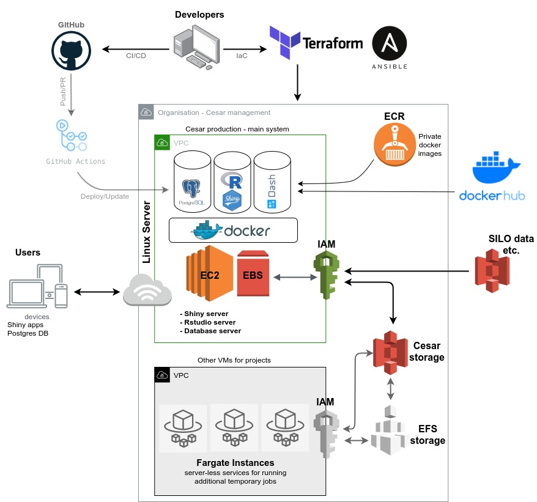

```{r setup, include=FALSE}
knitr::opts_chunk$set(
  echo = TRUE,
  eval = FALSE,
  message = FALSE,
  warning = FALSE,
  fig.align = "center"
)
```

## Overview

Here is an overview of the workflow and major components of the server and the services provided. Each component will be explained in the following sections.

```{r, echo=FALSE, eval=TRUE, out.width = 700, echo=F, fig.align="center"}

```

## Software and resources

- Terraform resource: 

- Ansible resource:

- Docker resource:

- GitHub action resouece:


## Terraform configuration

## Ansible configuration


## Docker containers

### Shiny server and apps


### PostgreSQL database

## GitHub actions